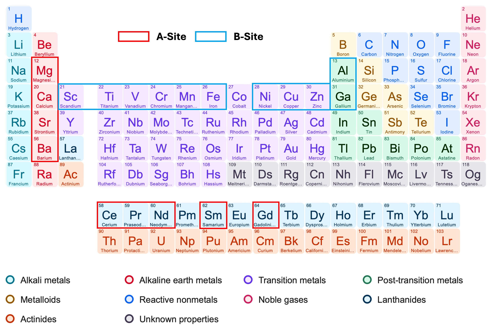

# Unraveling Doping Effects in LaCoO3 via Machine Learning-Accelerated First-Principles Simulations


[](https://doi.org/xxx.xxx/xxx.xxx)

## Overview

An application for analyzing dopant effects on LaCoO3 (LCO), supporting composition optimization and material performance enhancement.

## Get Started

* 🌐 [Try it Online](https://lco-doper.streamlit.app/)

* ⭐️ Please STAR this repository if you find it helpful :)

* For any questions or suggestions, please contact us (gliu4@wpi.edu; yzhong@wpi.edu).

## Usage Description

1. **Select Dopants and Concentration**: In the `Dopants Selection` section, choose the desired dopants and their concentrations (at.%) for both A and B sites in the LCO structure. Supported dopants include:
    - A-site: Mg, Ca, Sr, Ba, Ce, Pr, Nd, Sm, Gd
    - B-site: Sc, Ti, V, Cr, Mn, Fe, Ni, Cu, Zn, Al, Ga

    <div align=left></div>

2. **Select System Conditions**: In the `System Conditions` section, specify the oxygen vacancy concentration (at.%) and the temperature (K) for the simulation. The temperature range is from 500 K to 2500 K. The oxygen vacancy concentration ranges from 0 at.% to 5 at.%. *Note that these settings only apply to diffusivity and conductivity predictions.*

3. **Predict**: Click the `Predict` button to initiate the prediction process. The system will analyze the selected dopants and conditions, and provide and visualize the prediction results for the following properties:
    - Energetic Stability
      - Formation Energy (eV/atom)
    - Structural Distortions
      - Lattice Distortion (%)
      - Atomic Distance (Å)
    - Diffusivity & Conductivity
      - Diffusion Coefficient (cm²/s)
      - Conductivity (S/cm)

## Cite Us
If you use this code in your research, please cite our paper:

```
@article{
  title={Unraveling Doping Effects in LaCoO3 via Machine Learning-Accelerated First-Principles Simulations},
  author={G. Liu and S. Yang and Y. Zhong},
  journal={},
  volume={},
  number={},
  pages={},
  year={2025}
}
```